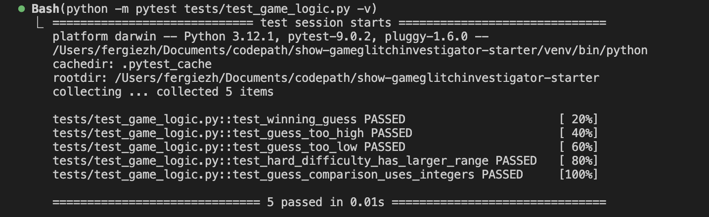

# 🎮 Game Glitch Investigator: The Impossible Guesser

## 🚨 The Situation

You asked an AI to build a simple "Number Guessing Game" using Streamlit.
It wrote the code, ran away, and now the game is unplayable. 

- You can't win.
- The hints lie to you.
- The secret number seems to have commitment issues.

## 🛠️ Setup

1. Install dependencies: `pip install -r requirements.txt`
2. Run the broken app: `python -m streamlit run app.py`

## 🕵️‍♂️ Your Mission

1. **Play the game.** Open the "Developer Debug Info" tab in the app to see the secret number. Try to win.
2. **Find the State Bug.** Why does the secret number change every time you click "Submit"? Ask ChatGPT: *"How do I keep a variable from resetting in Streamlit when I click a button?"*
3. **Fix the Logic.** The hints ("Higher/Lower") are wrong. Fix them.
4. **Refactor & Test.** - Move the logic into `logic_utils.py`.
   - Run `pytest` in your terminal.
   - Keep fixing until all tests pass!

## 📝 Document Your Experience

- [✅] Describe the game's purpose.

  **Game's Purpose:**
  A number-guessing game built with Streamlit. The player picks a difficulty (Easy: 1–20, Normal: 1–100, Hard: 1–200) and tries to guess the secret number within the attempt limit (Easy: 7, Normal: 10, Hard: 12), using Higher/Lower hints. Points are awarded based on how few attempts it takes.

- [✅] Detail which bugs you found.

  **Bugs Found:**
  1. Higher/Lower hints were backwards — guessing too high told the player to go higher
  2. Secret number silently converted to a string on every even-numbered attempt, breaking integer comparison and making those turns unwinnable
  3. Hard difficulty range was (1, 50) — smaller than Normal's (1, 100), making Hard actually easier
  4. Attempt limits were backwards — Hard had only 5 attempts despite the largest range
  5. "New Game" button hardcoded `random.randint(1, 100)` regardless of difficulty setting
  6. Switching difficulty did not reset the secret, so Easy mode could still have a secret of 98
  7. Attempts counter initialized to 1 instead of 0, causing off-by-one display from the start
  8. Out-of-range guesses were accepted and consumed an attempt with no warning
  9. Score rewarded wrong "Too High" guesses on even attempts (+5 instead of −5)

- [✅] Explain what fixes you applied.

  **Fixes Applied:**
  1. Swapped hint messages in `check_guess()` so direction matches the outcome
  2. Removed the `str()` conditional; secret is always compared as an integer
  3. Changed Hard range to (1, 200) so difficulty properly scales: Easy < Normal < Hard
  4. Rebalanced attempt limits to Easy=7, Normal=10, Hard=12
  5. Fixed "New Game" to use `random.randint(low, high)` based on selected difficulty
  6. Added difficulty-change detector to reset all session state when difficulty switches
  7. Initialized attempts counter to 0
  8. Added range validation; out-of-range guesses show an error and do not consume an attempt
  9. Simplified score logic: every wrong guess is −5, win score = 100 − 10×(attempts−1), min 10

## 📸 Demo

- [x] pytest results — all 5 tests passing:

  

## 🚀 Stretch Features

- [ ] [If you choose to complete Challenge 4, insert a screenshot of your Enhanced Game UI here]
